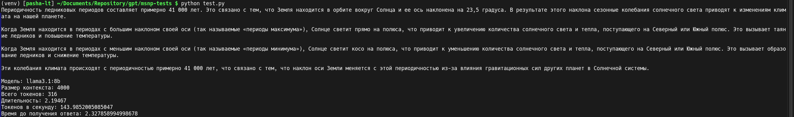

# LLM MSNP Tests

A small and collection of results, if checks speed of GGUF model on different combination of GPUs and CPUs.

Inspired due to conversation in Telegram chat.

## MSNP Leaderboards

https://huggingface.co/spaces/evilfreelancer/msnp-leaderboard

## How to test

First you need to install [ollama](https://ollama.com/download) to server where you will make tests.

Download models:

```shell
ollama pull llama3.1:8b-instruct-q4_0
ollama pull llama3.1:70b-instruct-q4_0
```

> Please use models with __quantization__ in name

Then you need to create Python Virtual Environment, then chroot to it:

```shell
mkdir msnp-tests
cd msnp-tests
python3 -m venv venv
source venv/bin/activate
```

Then download requirements and tests.py files:

```shell
wget https://raw.githubusercontent.com/EvilFreelancer/llm-msnp-tests/refs/heads/main/requirements.txt
wget https://raw.githubusercontent.com/EvilFreelancer/llm-msnp-tests/refs/heads/main/test.py
```

Install dependencies:

```shell
pip install -r requirements.txt
```

And run test:

```shell
python3 test.py 
```

In result will be something like this:


